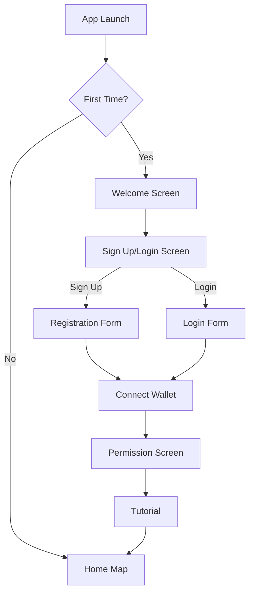
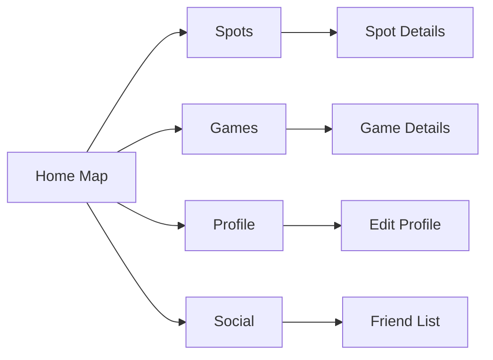
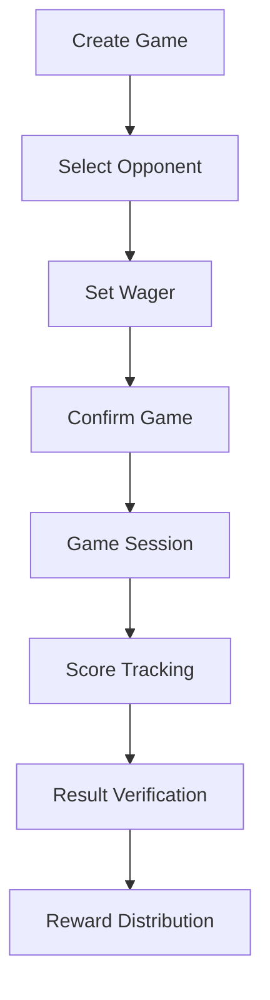
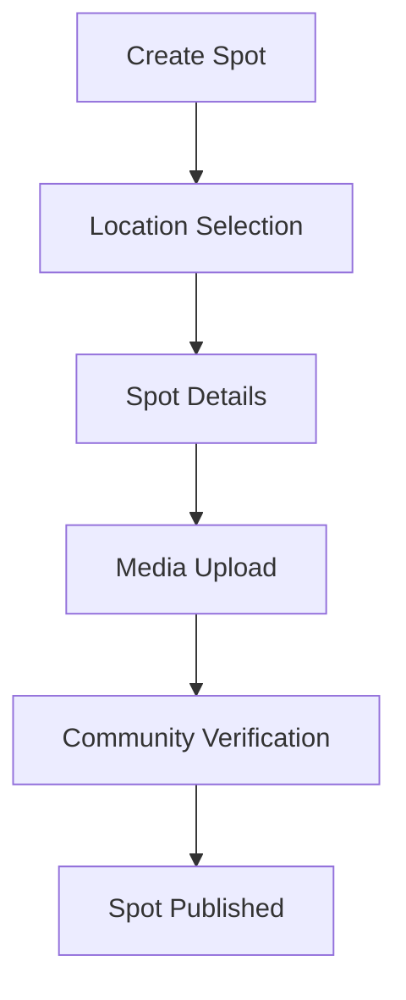
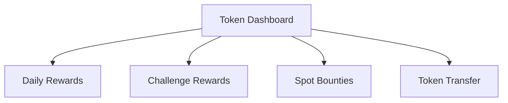
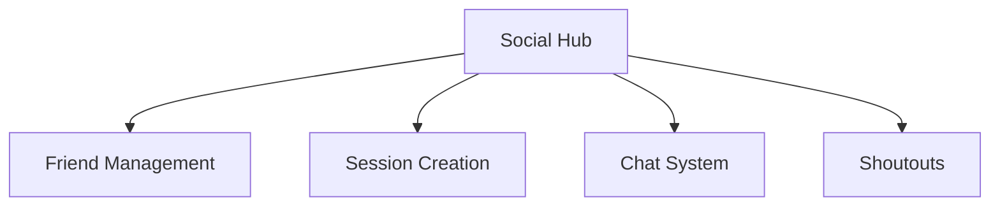
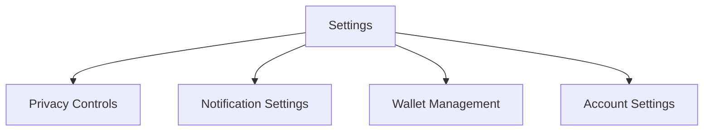

# User Flow Documentation

## 1. Authentication Flow

### 1.1 Initial Launch

#### Screens:
1. **Welcome Screen**
   - App logo and tagline
   - "Get Started" button
   - "Already have an account? Login" link

2. **Registration Form**
   - Email input
   - Password input
   - Username input
   - "Sign Up" button
   - Social login options

3. **Login Form**
   - Email/Username input
   - Password input
   - "Login" button
   - "Forgot Password?" link

4. **Connect Wallet**
   - Wallet connection options
   - Information about wallet usage
   - Skip option (limited functionality)

5. **Permission Screen**
   - Location permission request
   - Notification permission request
   - Camera permission request (for spot photos)

## 2. Main Navigation Flow

### 2.1 Core Navigation

#### Screens:
1. **Home Map Screen**
   - Interactive map showing:
     - Active skaters (with privacy toggles)
     - Verified spots
     - Ongoing games
     - Live sessions
   - Quick action buttons:
     - Toggle active status
     - Create game
     - Start session
     - Add spot

2. **Spots Screen**
   - List/grid view of nearby spots
   - Search and filter options
   - Spot categories
   - Add new spot button (for Legends)

3. **Games Screen**
   - Active challenges
   - Past games
   - Leaderboard
   - Create challenge button

4. **Profile Screen**
   - User stats and rank
   - Token balance
   - Achievement badges
   - Game history
   - Created/verified spots

5. **Social Screen**
   - Friend list
   - Friend requests
   - Nearby skaters
   - Active sessions

## 3. Game Flow

### 3.1 Creating and Playing Games

#### Screens:
1. **Create Game Screen**
   - Opponent selection
   - Wager amount input
   - Game rules selection
   - Location confirmation

2. **Game Session Screen**
   - Timer
   - Trick input interface
   - Score display
   - Witness list
   - Chat/communication

3. **Result Verification Screen**
   - Winner selection
   - Attestation interface
   - Witness signatures
   - Reward preview

## 4. Spot Management Flow

### 4.1 Spot Creation and Verification

#### Screens:
1. **Create Spot Screen**
   - Map for location selection
   - Spot name input
   - Description input
   - Category selection
   - Photo/video upload

2. **Spot Details Screen**
   - Spot information
   - Photos/videos
   - Difficulty rating
   - Active challenges
   - Check-in history
   - Verification status

## 5. Token and Rewards Flow

### 5.1 Token Management

#### Screens:
1. **Token Dashboard Screen**
   - Token balance
   - XP progress
   - Daily rewards status
   - Active bounties
   - Transaction history

2. **Bounty Screen**
   - Available bounties
   - Reward amounts
   - Completion criteria
   - Submission interface

## 6. Social Features Flow

### 6.1 Social Interactions

#### Screens:
1. **Social Hub Screen**
   - Activity feed
   - Friend suggestions
   - Nearby sessions
   - Quick actions

2. **Session Creation Screen**
   - Location selection
   - Time and duration
   - Visibility settings
   - Invite friends

3. **Chat Screen**
   - Direct messages
   - Group chats
   - Session chats
   - Media sharing

## 7. Error Handling

### 7.1 Common Error Scenarios
- Network connectivity issues
- Location services disabled
- Wallet connection failures
- Transaction failures
- Permission denials

#### Error Screens:
1. **Network Error Screen**
   - Offline mode indication
   - Retry button
   - Cached data access

2. **Permission Error Screen**
   - Required permission explanation
   - Enable permission button
   - Alternative options

3. **Transaction Error Screen**
   - Error details
   - Retry options
   - Support contact

## 8. Settings and Configuration

### 8.1 User Settings

#### Screens:
1. **Settings Screen**
   - Privacy controls
   - Notification preferences
   - Wallet connections
   - Language selection
   - Theme options
   - Support access

2. **Privacy Control Screen**
   - Location sharing options
   - Profile visibility
   - Activity broadcasting
   - Block list management

## 9. Progressive Onboarding

### 9.1 Feature Discovery
- Tutorial overlays for new features
- Contextual help
- Achievement unlocks
- Rank progression celebrations

#### Tutorial Screens:
1. **Feature Introduction**
   - Step-by-step guides
   - Interactive demos
   - Skip option
   - Progress indicator

2. **Achievement Screen**
   - Unlock animation
   - New feature explanation
   - Next steps guidance

## 10. Accessibility Considerations

### 10.1 Accessibility Features
- High contrast mode
- Screen reader support
- Customizable text size
- Alternative navigation methods

## 11. Offline Support

### 11.1 Offline Functionality
- Cached spot data
- Offline game creation
- Pending transaction queue
- Local data synchronization

#### Offline Screens:
1. **Offline Mode Indicator**
   - Sync status
   - Pending actions
   - Available offline features